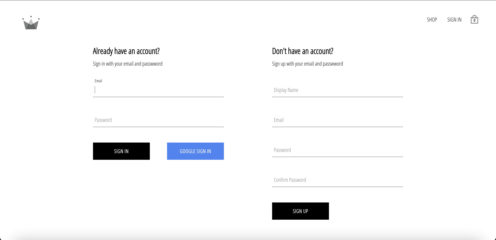
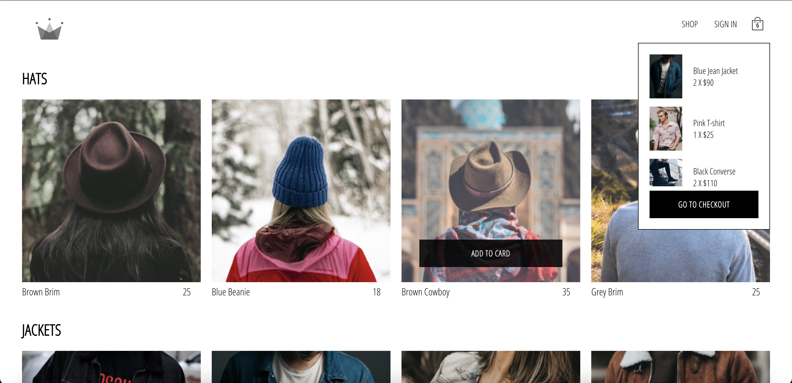

# Clothing E-commerce






> Front-end using React.js <br>
> Back-end using Firebase <br>
> [Deploy on Netlify](https://delightful-paprenjak-ed2810.netlify.app/)


Features:

- 完整的電子商務平台，允許用戶瀏覽和購買服裝商品
- 使用 React.js 構建的動態前端，提供無縫的用戶體驗
- 整合 json-server 作為後端，實現模擬的數據庫功能
- 可以按類別瀏覽商品，方便用戶尋找心儀的款式
- 支持用戶註冊、登入和個人資料管理
- 購物車功能，用戶可以添加和管理購買的商品

### Install packages

```bash
npm i
```

### Start the app

```bash
npm start
```